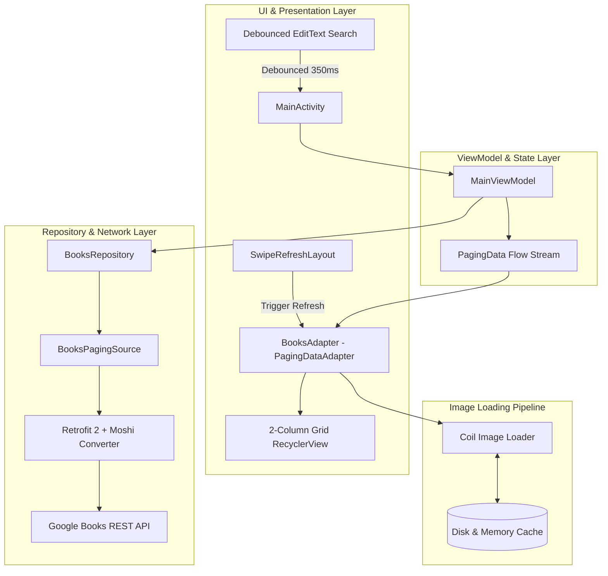

# BookWiz

[](https://www.android.com/)
[](https://kotlinlang.org/)
[](https://developer.android.com/topic/libraries/architecture/paging/v3-overview)
[](https://square.github.io/retrofit/)
[](https://coil-kt.github.io/coil/)
[](https://developer.android.com/)
[-00BCD4?style=for-the-badge)](https://developer.android.com/)
[](LICENSE)

> A modern Android book discovery engine powered by the Google Books REST API, featuring Jetpack Paging 3 infinite scroll, debounced real-time search, Coil image caching, and a responsive two-column grid.

---

## 📖 Overview

**BookWiz** is a performant Android application designed for exploring, searching, and discovering literature from Google Books' massive global catalog. Designed around reactive asynchronous streams and memory-efficient pagination, BookWiz delivers a smooth, native browsing experience.

The app implements **Android Jetpack Paging 3** with custom `PagingSource` pagination to fetch volume batches on-demand, paired with **Retrofit 2** and **Moshi** for type-safe JSON deserialization, **Coil** for asynchronous image caching, and a 350ms debounced search pipeline powered by Kotlin Coroutines.

### Key Highlights
- **Infinite Scrolling (Paging 3)**: Seamless, memory-bounded pagination streaming Google Books API data as users scroll.
- **Debounced Real-Time Search**: Automatic 350ms Coroutine debouncing cancels stale requests and queries instantly upon typing.
- **Curated Featured Discovery**: Automatically falls back to a curated featured selection when the search field is cleared.
- **Asynchronous Image Pipeline**: Uses Coil with HTTPS URL normalization, cross-fades, and rounded transformations for crisp book cover presentation.

---

## 🏗️ Architecture & Data Flow

BookWiz follows the **Android Jetpack MVVM (Model-View-ViewModel)** architecture integrated with the **Jetpack Paging 3** library.



---

## ✨ Core Features

### 🔍 Debounced Reactive Search
- Real-time text watcher with a 350ms debounce coroutine job to prevent API rate-limiting while providing immediate search feedback.
- Dynamic fallback: When the search input is empty, the interface automatically presents a curated featured reading stream.

### 📜 Seamless Paging 3 Infinite Scroll
- Implements `PagingDataAdapter` and `PagingConfig` (page size = 20 items) to fetch next-page results without blocking the main UI thread.
- Unified load-state listening binding the `SwipeRefreshLayout` progress indicator directly to Paging 3 `LoadState.Loading`.

### 🖼️ High-Performance Book Cover Art Caching
- Asynchronous image fetching via **Coil** with automatic HTTP-to-HTTPS URL sanitization.
- Rounded corner post-processing and memory-efficient bitmap pooling.

### 📐 2-Column Responsive Grid
- `GridLayoutManager` paired with custom `GridSpacingItemDecoration` ensuring consistent 8dp spacing and edge alignment across all screen densities.

---

## 📱 Key Screens & UI Components

| Screen / Component | Class | Description |
|---|---|---|
| **Main Explorer** | `MainActivity` | Main screen featuring the debounced search bar, SwipeRefreshLayout, and 2-column book grid. |
| **Search Screen** | `SearchActivity` | Search activity for targeted queries. |
| **Grid Adapter** | `BooksAdapter` | `PagingDataAdapter` handling volume item diffing, Coil image rendering, and author metadata formatting. |
| **Spacing Decorator** | `GridSpacingItemDecoration` | Item decoration computing exact margin offsets for multi-column grid layouts. |
| **API Client** | `GoogleBooksApi` | Retrofit interface defining search and pagination endpoints for Google Books volumes. |

---

## 🛠️ Technical Stack Matrix

| Layer / Concern | Technology / Library | Version / Details |
|---|---|---|
| **Platform** | Android OS | `minSdk 24` (Android 7.0) / `targetSdk 35` (Android 15) / `compileSdk 35` |
| **Language** | [Kotlin](https://kotlinlang.org/) | 1.9+ |
| **Architecture** | MVVM + Paging 3 Pattern | Jetpack Lifecycle (`ViewModel`, `lifecycleScope`) |
| **Pagination** | [AndroidX Paging 3](https://developer.android.com/topic/libraries/architecture/paging/v3-overview) | Infinite scrolling with `PagingData` and `PagingSource` |
| **Networking** | [Retrofit 2](https://square.github.io/retrofit/) | Type-safe REST client for Google Books API |
| **JSON Serialization** | [Moshi Kotlin](https://github.com/square/moshi) | High-performance JSON parser with KAPT codegen |
| **Image Loading** | [Coil](https://coil-kt.github.io/coil/) | Kotlin-first coroutine image loading and caching |
| **UI Components** | AndroidX & Material Design 3 | GridLayoutManager, SwipeRefreshLayout, ViewBinding |
| **Build System** | Gradle Kotlin DSL (`build.gradle.kts`) | AGP 8.7+ |

---

## 📂 Project Structure

```text
BookWiz/
├── app/
│   ├── src/
│   │   ├── main/
│   │   │   ├── java/com/example/bookfinder/
│   │   │   │   ├── data/
│   │   │   │   │   ├── model/
│   │   │   │   │   │   └── Volume.kt              # Moshi JSON response models
│   │   │   │   │   ├── network/
│   │   │   │   │   │   ├── GoogleBooksApi.kt      # Retrofit API endpoints
│   │   │   │   │   │   └── RetrofitModule.kt      # Retrofit & Moshi singleton provider
│   │   │   │   │   └── repository/
│   │   │   │   │       └── BooksRepository.kt     # PagingSource data repository
│   │   │   │   └── ui/
│   │   │   │       ├── MainActivity.kt            # Discovery explorer activity
│   │   │   │       ├── SearchActivity.kt          # Alternative search view
│   │   │   │       ├── MainViewModel.kt           # Search & featured PagingData streams
│   │   │   │       ├── ViewModelFactory.kt        # ViewModel Factory
│   │   │   │       ├── BooksAdapter.kt            # PagingDataAdapter with Coil image binding
│   │   │   │       └── GridSpacingItemDecoration.kt # Custom grid layout spacing decorator
│   │   │   ├── res/
│   │   │   │   ├── layout/
│   │   │   │   │   ├── activity_main.xml          # Main grid & search view layout
│   │   │   │   │   └── item_book.xml              # Grid item card layout
│   │   │   │   └── values/                        # Colors, strings, themes
│   │   │   └── AndroidManifest.xml
│   ├── build.gradle.kts
│   └── proguard-rules.pro
├── gradle/
│   └── libs.versions.toml
├── build.gradle.kts
├── LICENSE
└── README.md
```

---

## 🚀 Getting Started

### Prerequisites
- **Android Studio** (Ladybug 2024.2+ or Hedgehog+).
- **JDK 17** or **JDK 21**.
- Android device or Emulator running **API 24 (Android 7.0)** or higher with Internet connectivity.

### Installation & Build

1. **Clone the repository**:
   ```bash
   git clone https://github.com/shayann07/BookWiz.git
   cd BookWiz
   ```

2. **Open in Android Studio**:
   - Open the directory in Android Studio and sync Gradle dependencies.

3. **Build the Debug APK**:
   ```bash
   ./gradlew assembleDebug
   ```

4. **Install & Run**:
   ```bash
   ./gradlew installDebug
   ```

---

## 📄 License

This project is licensed under the **MIT License** — see the [LICENSE](LICENSE) file for complete details.

```text
Copyright (c) 2026 shayann07
```
